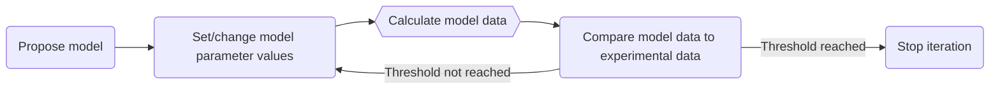

# Model-dependent analysis

There are two general approaches to the analysis of data; **model-dependent** and **model-independent**. In the following examples, we are going to focus on the former. However, the latter is worth briefly highlighting. 

## Model-independent analysis

A model-independent approach to analysis is where no assumptions are made about the system that is being studied and conclusions are drawn only from the data that has been observed. However, in many applications, it is desirable to include what we think we know about the system, and so model-dependent analysis is used.

## Model-dependent analysis

Model-dependent analysis involves the development of a mathematical model that describes the model dataset that would be found for our system. This mathematical model usually has parameters that are linked to the physics and chemistry of our system. These parameters are varied to optimise the model, using an optimisation algorithm, with respect to the experimental data, i.e., to get the best agreement between the model data and the experimental data. 

Below is a diagram illustrating this process:

Model-dependent analysis is popular in the analysis of neutron scattering data, and we will use it in the following examples.

## Minimisation engines

EasyDiffraction uses different third-party libraries to perform the model-dependent analysis.

Most of the examples in this section will use the [lmfit](https://lmfit.github.io/lmfit-py/) package, which provides a high-level interface to non-linear optimisation and curve fitting problems for Python. It is one of the tools that can be used to fit models to the experimental data.

Another one is [Bumps](https://github.com/bumps/bumps). This one provides data fitting and Bayesian uncertainty modeling for inverse problems. Bumps has a variety of optimization algorithms available for locating the most like value for function parameters given data, and for exploring the uncertainty around the minimum.
